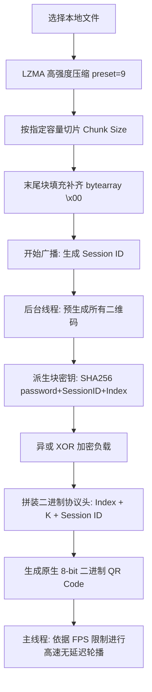
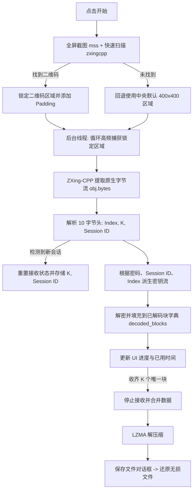

# QR Code GUI File Transfer Tool (基于二维码与屏幕捕获的文件加密传输工具)

这是一个基于 Python Tkinter GUI 开发的、完全处于**物理隔离/离线状态**下的文件传输系统。它通过在发送端屏幕轮播加密二维码，并在接收端通过高频屏幕捕获与快速解码算法实现文件的无网络交互、无损且加密的安全传输。

---

## 🛠️ 技术架构与核心逻辑梳理

本系统由两个核心部分组成：发送端 ([qr_sender_gui.py](file:///c:/Users/HIZONE/Desktop/qr_gui_tool/qr_sender_gui.py)) 和接收端 ([qr_receiver.py](file:///c:/Users/HIZONE/Desktop/qr_gui_tool/qr_receiver.py))。

### 1. 发送端 (`qr_sender_gui.py`) 逻辑梳理

发送端的核心职责是：**压缩文件 ➔ 分块 ➔ 加密 ➔ 二进制流封装 ➔ 生成二维码 ➔ 高速轮播**。

#### 流程图示


#### 关键技术点：
* **数据压缩**：使用 Python 内置的 `lzma` 模块进行极高比例的压缩（默认压缩等级为 9），以显著减少需要通过二维码传输的总数据量。
* **等长切片与补齐**：为了满足等长传输与加密的对齐要求，所有切片必须绝对等长。若最后一个数据块不足单帧容量，则在右侧使用 `\x00` 进行填充。
* **SHA-256 流式加密**：
  * 使用密码、当前 Session ID（秒级时间戳）和块索引（`block_idx`）作为输入，经过 SHA-256 派生出专属的 32 字节哈希值 `h`。
  * 以 `h + 4字节计数器(Counter)` 不断哈希拼接，生成与切片等长的伪随机密钥流（Keystream）。
  * 将原始数据切片与密钥流进行异或（XOR）运算，实现高强度的流式加密。
* **协议头封装**：每个二维码均包含一个 10 字节的协议头（大端字节序）：
  * `block_idx` (4 字节, 无符号整数 `>I`)：当前块的索引。
  * `K` (2 字节, 无符号短整数 `>H`)：总块数。
  * `session_id` (4 字节, 无符号整数 `>I`)：当前的传输会话标识。
* **8-bit 二进制二维码**：不进行 Base64 等文本编码以避免 33% 的体积开销，直接将包装后的原生 10 字节协议头 + 加密负载传递给 `qrcode` 库生成二维码。
* **预生成优化**：启动广播时，先在后台线程中将所有二维码图片全部生成并缓存，随后在主线程中进行“纯轮播”展示，从而彻底消除实时生成二维码带来的 GUI 卡顿与 FPS 抖动。

---

### 2. 接收端 (`qr_receiver.py`) 逻辑梳理

接收端的核心职责是：**捕获屏幕 ➔ 快速定位二维码 ➔ 解码二进制流 ➔ 协议解析 ➔ 解密负载 ➔ 收集重组 ➔ LZMA解压 ➔ 保存文件**。

#### 流程图示


#### 关键技术点：
* **自动对齐/校准**：启动时先截取一次全屏，利用 `zxingcpp` 快速定位发送端二维码的位置，并以此为基准建立一个带有边距（Padding 40px）的局部截屏窗口。此举避免了每次都截取全屏带来的巨大 CPU 负荷。
* **极速解码（`zxing-cpp`）**：选用现代化的 `zxing-cpp` 引擎代替原生的 `pyzbar`，其解码速度和抗污损/倾斜能力大幅提升，支持直接返回 `bytes` 数据。
* **异步多线程**：截屏与解码在后台线程高频运行，而 UI 画面渲染和状态更新则限制在约 15 FPS，以确保主线程不会因刷新过快而假死，并将所有计算资源留给后台的图像解码。
* **幂等块收集**：利用 Session ID 机制，程序可以自动识别全新的文件传输并重置计数。通过字典 `decoded_blocks` 收集数据，能自然过滤掉重复扫描的帧（幂等性）。
* **无损解密还原**：全部数据块收齐后，拼接二进制数据，直接使用 `lzma.LZMADecompressor` 还原。

---

## ✨ 核心特性

1. **绝对物理隔离传输**：无需 Wi-Fi、蓝牙、网线或任何网络协议，真正实现跨物理隔离屏障的数据传输。
2. **端到端流加密**：每一帧的加密密钥流均结合了用户密码、会话随机数与帧序号，即使被拍照截包也无法逆向破解。
3. **高效空间利用**：
   * **LZMA-9** 高强度的文件压缩。
   * 二维码采用原生 **8-bit 字节模式**（Byte Mode），没有 Base64 带来的冗余开销。
4. **性能极致优化**：
   * **发送端**：预生成图像缓存 + FPS 控制。
   * **接收端**：智能定位局部裁剪 + zxing-cpp 极速解码 + 渲染限帧（约 15 FPS）保护 CPU。
5. **用户友好 UI**：
   * 基于 Tkinter 现代化改良的布局。
   * 发送端提供容量预估、压缩率反馈、预计用时估算。
   * 接收端配备动态绿框追踪定位、解码进度条、日志窗口与灵活的“另存为”保存对话框。

---

## 📦 依赖安装

在运行发送端和接收端之前，请确保已安装以下 Python 库：

```bash
pip install qrcode pillow opencv-python numpy mss zxing-cpp
```

> **注意**：Windows 系统下推荐使用标准的 `pip` 进行安装。`zxing-cpp` 提供了飞一般的解码体验，请务必保证其安装成功。

---

## 🚀 使用指南

### 第一步：启动发送端与接收端
* 运行发送端：
  ```bash
  python qr_sender_gui.py
  ```
* 运行接收端：
  ```bash
  python qr_receiver.py
  ```

### 第二步：配置发送端并预备
1. 在发送端点击 **“浏览...”**，选择需要发送的目标文件（如：图片、压缩包、文档等）。
2. （可选）根据需要调整 **单帧容量 (字节)** 和 **刷新率 (FPS)**。
   * *单帧容量* 越大，二维码越复杂，对摄像头/截屏的清晰度要求越高。推荐使用默认的 `1024`。
   * *刷新率 (FPS)* 越高，传输越快。推荐在 `15.0 ~ 25.0` 之间，取决于接收端的处理性能。
3. 在发送端和接收端的 **“密钥”** 输入框中，输入相同的传输密码（默认为 `123456`）。

### 第三步：校准接收端与开启传输
1. 将发送端窗口摆放在屏幕任意位置（请不要遮挡发送端的灰色二维码预览画布）。
2. 在接收端，点击 **“▶ 开始”**。
   * 接收端会瞬间截取全屏并进行定位。一旦检测到发送端的二维码区域，接收端将锁定该位置（状态变为绿色的“锁定”），并显示实时的局部画面。
3. 在发送端，点击 **“▶ 开始广播 (无尽模式)”**。
4. 此时接收端会开始飞速抓图解码，界面上的进度条和日志将实时滚动，显示每一个碎片块的成功解密恢复。

### 第四步：完成与保存
1. 当接收端进度条达到 100%（例如：`解码进度: 25 / 25`），接收端将自动结束截屏并弹出 **“保存接收到的文件”** 另存为对话框。
2. 选择合适的路径和文件名保存，系统将自动无损还原并校验文件。
3. 保存完成后，接收端界面会自动**重置为就绪状态**，支持立即开始下一次文件的接收。
